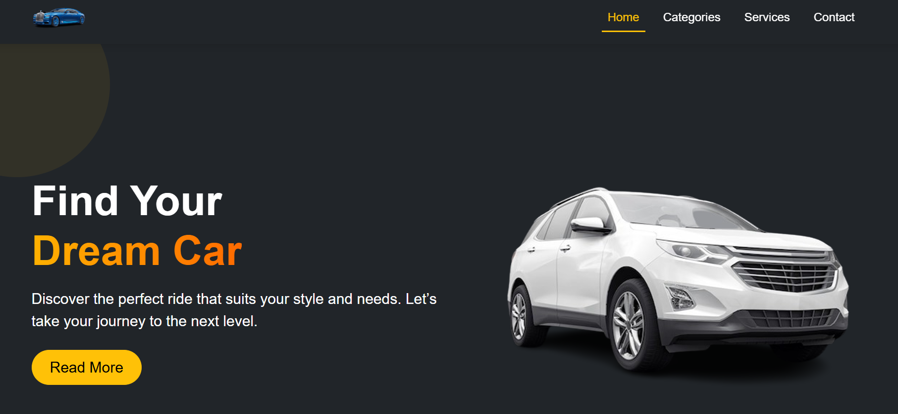

# Modrino - Car Website UI

A fully responsive and modern car dealership landing page built using **HTML**, **Bootstrap 5**, and **custom CSS** — with subtle animations and smooth interactions to enhance user experience.

## 🔗 Live Preview

[🔗 Click here to visit the live site](https://modrino.vercel.app/)

## 🖼️ Screenshot Preview

## 📌 Overview

This project took approximately **7 to 8 hours** to complete.

The main objective was to replicate a Figma UI design as closely as possible using Bootstrap and custom styling. Through this process, I gained deeper insights into the limitations and flexibility of CSS frameworks from the perspective of a junior frontend developer.

## 💡 Developer's Reflection

While working on this project, I realized:

- **Bootstrap 5** is excellent for pre-built UI components like navbars, cards, and modals. However, it becomes challenging when trying to achieve pixel-perfect accuracy from a Figma design — especially for beginners.
- Achieving a custom layout often requires overriding Bootstrap styles or writing additional CSS.
- **Tailwind CSS**, on the other hand, offers a more utility-first approach, making it easier to create design-accurate layouts without excessive CSS.

For developers focused on Figma-to-code accuracy, **Tailwind CSS is a more flexible and scalable solution**.

## 🔧 Technologies Used

- HTML5  
- Bootstrap 5  
- Custom CSS  
- JavaScript (for navbar scroll behavior)  
- Animate.css + WOW.js (for smooth scroll animations)

## ✨ Key Features & Animations

- ✅ Sticky & animated navbar with scroll effect  
- ✅ Section-based smooth scrolling  
- ✅ Hover effects and transitions  
- ✅ Entry animations (using WOW.js and animate.css)  
- ✅ Fully responsive across all devices  
- ✅ Clean and minimal UI adapted from a Figma file

## 🧠 Lessons Learned

- Framework choice should align with the UI goal.
- Utility-first CSS (like Tailwind) is often better for Figma-level precision.
- Bootstrap is perfect for component reuse but less flexible in design freedom.
- Animations add life to a layout — when used correctly, they improve UX without overwhelming.

## ✍️ Author

**Mehedi Hasan Rabbi**  
Junior Front-End Developer  
🌐 [GitHub](https://github.com/mehedihasanrabbivip) 

## 📌 Final Note

This project is a small but meaningful step in my frontend journey.  
Though senior developers may see this as a basic exercise, for junior developers like me, it’s full of lessons in design, structure, animation, and workflow.

Thank you for visiting **Modrino** — your dream car starts here! 🚗✨
